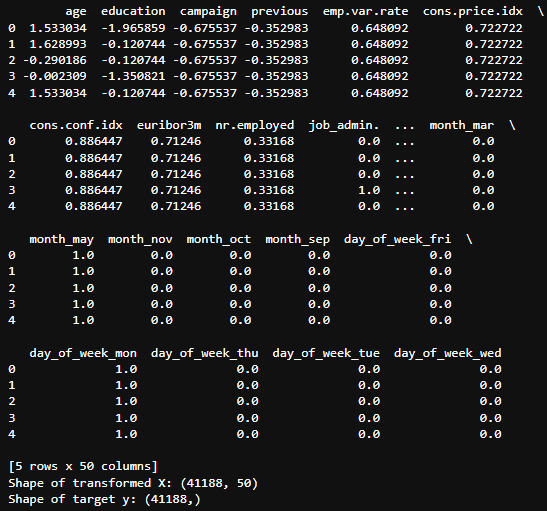
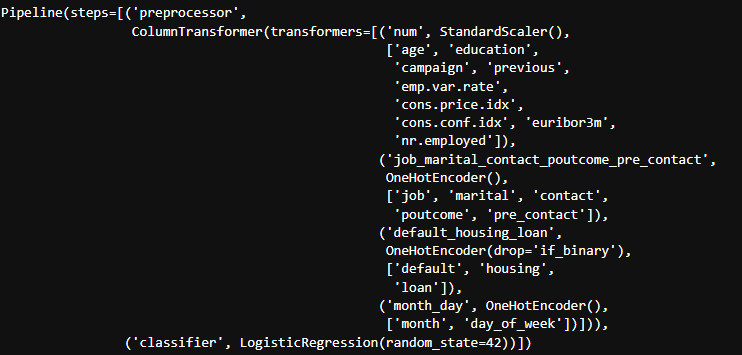

# Bank-Marketing-Term-Deposit-Subscription-Prediction

### Project Overview:

In this Project, our goal is to compare the performance of the classifiers we encountered in this section, namely K Nearest Neighbor, Logistic Regression, Decision Trees, and Support Vector Machines. We will utilize a dataset related to marketing bank products over the telephone.  

### Background:

Our dataset comes from the UCI Machine Learning repository [link](https://archive.ics.uci.edu/ml/datasets/bank+marketing).  The data is from a Portugese banking institution and is a collection of the results of multiple marketing campaigns.  We will make use of the article accompanying the dataset [here](CRISP-DM-BANK.pdf) for more information on the data and features.

The data is related with direct marketing campaigns of a Portuguese banking institution. The marketing campaigns were based on phone calls. Often, more than one contact to the same client was required, in order to access if the product (bank term deposit) would be ('yes') or not ('no') subscribed. The classification goal is to predict if the client will subscribe (yes/no) a term deposit (variable y).

#### CRISP-DM Framework:

We will follow the CRISP-DM framework, a widely-used process in the industry for data projects:

### Business Understanding

- **Objective:** Develop a predictive model to assist in targeted marketing efforts aimed at increasing subscription to term deposits. The primary focus of the model should be on accurately identifying customers who are likely to subscribe (i.e., those who have responded positively). While it's acceptable for the model to occasionally misclassify customers who are unlikely to subscribe as potential subscribers, it's crucial to minimize false negatives—instances where actual subscribers are incorrectly classified as non-subscribers. By prioritizing accuracy in identifying potential subscribers, the model aims to optimize resource allocation and maximize the effectiveness of marketing campaigns, ultimately enhancing the bank's subscription rate for term deposits.

### Data Exploration

- **Initial dataset information**

- **Initial dataset statistical summary for numerical features**

- **Understanding the Features**

- Input variables:

1. age (numeric)
2. job : type of job (categorical: 'admin.','blue-collar','entrepreneur','housemaid','management','retired','self-employed','services','student','technician','unemployed','unknown')
3. marital : marital status (categorical: 'divorced','married','single','unknown'; note: 'divorced' means divorced or widowed)
4. education (categorical: 'basic.4y','basic.6y','basic.9y','high.school','illiterate','professional.course','university.degree','unknown')
5. default: has credit in default? (categorical: 'no','yes','unknown')
6. housing: has housing loan? (categorical: 'no','yes','unknown')
7. loan: has personal loan? (categorical: 'no','yes','unknown')

- related with the last contact of the current campaign:

8. contact: contact communication type (categorical: 'cellular','telephone')
9. month: last contact month of year (categorical: 'jan', 'feb', 'mar', ..., 'nov', 'dec')
10. day_of_week: last contact day of the week (categorical: 'mon','tue','wed','thu','fri')
11. duration: last contact duration, in seconds (numeric). Important note: this attribute highly affects the output target (e.g., if duration=0 then y='no'). Yet, the duration is not known before a call is performed. Also, after the end of the call y is obviously known. Thus, this input should only be included for benchmark purposes and should be discarded if the intention is to have a realistic predictive model.

- other attributes:

12. campaign: number of contacts performed during this campaign and for this client (numeric, includes last contact)
13. pdays: number of days that passed by after the client was last contacted from a previous campaign (numeric; 999 means client was not previously contacted)
14. previous: number of contacts performed before this campaign and for this client (numeric)
15.  poutcome: outcome of the previous marketing campaign (categorical: 'failure','nonexistent','success')

- social and economic context attributes

16. emp.var.rate: employment variation rate - quarterly indicator (numeric)
17. cons.price.idx: consumer price index - monthly indicator (numeric)
18. cons.conf.idx: consumer confidence index - monthly indicator (numeric)
19. euribor3m: euribor 3 month rate - daily indicator (numeric)
20. nr.employed: number of employees - quarterly indicator (numeric)

- Output variable (desired target):

21. y - has the client subscribed a term deposit? (binary: 'yes','no')

We can see there are 11 categorical features and 10 numerical features. This dataset seems comprehensive and suitable for classification tasks. Before jumping into model building, it's crucial to understand the data. This involves exploring the distributions of features, handling outliers if any, dropping features that may not be useful and understanding the relationships between features and the target variable.

#### Data distribution visualization 

- The histograms for numerical features show the distribution of values for each numerical variable in the dataset. Each histogram helps to visualize the distribution of values for each numerical feature, which can provide insights into the underlying data distribution and potential outliers.

- Countplot of categorical features to visualize data distibution 

#### Data Obervation

In the exploration of features containing unknown values, we find that several categorical features have a notable presence of 'unknown' values, including 'job', 'marital', 'education', 'default', 'housing', and 'loan'. These 'unknown' values could represent missing or unrecorded data, which need to be handled appropriately during preprocessing. Notably, 'default', 'housing', and 'loan' features have a significant number of 'unknown' values compared to their other categories. This observation suggests that these features may not be reliably recorded or may not be applicable to certain individuals. Additionally, the 'education' feature shows a range of education levels, with 'university.degree' being the most common followed by 'high.school' and 'basic.9y'. However, the presence of 'unknown' education levels underscores potential data quality issues. Furthermore, exploring correlations between features can provide insights into relationships that may exist among variables. For instance, correlations between features such as 'education' and 'job' could indicate associations between education levels and employment types. Overall, this initial exploration highlights the need for careful preprocessing, including handling unknown values and considering the relationships between features, to ensure the quality and effectiveness of subsequent modeling efforts.

#### Correlation Matrix 

The correlation matrix provides a visual representation of the relationships between numerical features in the dataset. In this heatmap, each cell represents the correlation coefficient between two features, ranging from -1 to 1. A correlation coefficient closer to 1 indicates a strong positive correlation, while a coefficient closer to -1 indicates a strong negative correlation. Features with a correlation coefficient close to 0 suggest a weak or no linear relationship.

From the heatmap, we can observe several noteworthy correlations:

**There is a strong positive correlation between 'euribor3m' and 'emp.var.rate', which is expected as these two features are related to economic indicators.**
**Similarly, 'nr.employed' and 'euribor3m' exhibit a strong positive correlation, indicating their association with employment rates and economic conditions.**
**Features such as 'cons.price.idx' and 'euribor3m' also show a moderate negative correlation, suggesting some inverse relationship between consumer price index and the three-month Euribor rate.**

Understanding these correlations can be valuable for feature selection and modeling. Highly correlated features may provide redundant information, which could potentially lead to overfitting in predictive models. Additionally, identifying correlated features can help in interpreting model results and understanding the underlying relationships in the data. However, it's important to note that correlation does not imply causation, and further analysis may be needed to validate any observed relationships.

### Data Cleaning and Preprocessing

- Handling Missing Values and Unknown Categories:

For features like 'job', 'marital', 'education', 'housing', and 'loan', the 'unknown' values are addressed by replacing them with the mode of their respective columns. Since 'default' has a significant 'unknown' category and 'yes' is extremely rare, 'unknown' is treated as a separate category without any imputation. This ensures that the data is appropriately handled without losing information.

- Ordinal Encoding of Education:

The 'education' feature, which likely represents different levels of education, is ordinally encoded. This means assigning numerical values to education levels in a way that preserves their ordinal relationship. For example, 'basic.4y' might be encoded as 1, 'basic.6y' as 2, and so on. This encoding allows the model to understand the inherent order in education levels, which could be meaningful for analysis and prediction.

- Removing Extreme Outliers in Numerical Features:

Extreme outliers in numerical features are identified and removed to ensure the robustness and accuracy of the model. Outliers can significantly skew the distribution of data and affect the performance of machine learning algorithms. By removing these outliers, the dataset is better suited for modeling and analysis.

- Transforming Target Variable:

The target variable 'y', which likely represents whether a client has subscribed to a term deposit, is transformed from a categorical ('yes' and 'no') to a numerical (1 and 0) format. This transformation allows for easier analysis and modeling, as numerical representations are often more convenient for machine learning algorithms.

Overall, these preprocessing steps aim to ensure that the dataset is clean, properly formatted, and ready for analysis and modeling tasks. By addressing missing values, encoding categorical features, removing outliers, and transforming the target variable, the dataset becomes more suitable for predictive modeling and gaining insights into the underlying data patterns.

We are storing our clean data in new copied dataset called df_cleaned to track and seperate cleaned and original sets. 

#### Imputation treatment for Unknown values intuitively

Imputation treatment for unknown values intuitively addresses missing data in the dataset by making informed assumptions based on common sense or intuition.

- Imputation for 'job' and 'education':

The function impute_split_unknown is applied to the 'job' and 'education' features. This function identifies the top two modes (most frequent values) in each feature and then randomly assigns 'unknown' values approximately equally between these top two modes. This approach acknowledges that the 'unknown' values could reasonably belong to the most prevalent categories in the dataset. By splitting the 'unknown' values between the top two modes, it maintains the distribution of the original data while addressing missing values.

- Imputation for 'marital', 'housing', and 'loan':

For 'marital', the intuitive choice is to replace 'unknown' values with 'single'. This assumption is based on the idea that if marital status is unknown, assuming 'single' is a reasonable approximation.
For 'housing' and 'loan', the approach is to replace 'unknown' values with 'no'. This decision is grounded in the assumption that if information about housing or loan status is not available, it's more likely that the individual does not have a housing loan or a personal loan.

Overall, these imputation treatments aim to handle missing values in a pragmatic way that aligns with intuitive assumptions about the data. By making reasonable guesses based on the distribution of existing data, the imputation process ensures that missing values are filled in a manner that reflects the underlying patterns in the dataset.

#### Ordinal Encoding 'Education'

- Mapping Education Levels to Ordinal Values:

The education levels are mapped to ordinal values ranging from 0 to 6. The mapping is based on the provided edu_map dictionary, where each education level is associated with a numerical value. The levels are ordered based on their perceived hierarchy or level of education, with lower values representing lower levels of education and higher values representing higher levels.

- Applying the Mapping:

The mapping is applied to the 'education' column of the DataFrame using the map function. This function replaces the original categorical education levels with their corresponding ordinal values according to the mapping defined in edu_map.

- Result:

After applying the ordinal encoding, the 'education' column now contains numerical values representing the education levels instead of the original categorical labels. This transformation allows machine learning algorithms to interpret the education levels as ordered categories, which can potentially improve the model's performance by capturing the inherent ordinal relationship between education levels.

Overall, the code snippet demonstrates a straightforward way to encode categorical variables with an ordinal relationship into numerical values, making them suitable for analysis and modeling purposes.

#### New feature pre_contact from pdays

By analyzing the distribution of the 'pdays' feature, which represents the number of days since the client was last contacted from a previous campaign. The percentage of clients not contacted prior to the current campaign is calculated and displayed, showing that approximately 96.32% of clients fall into this category. The plot below visually illustrates this, with the count of clients having 'pdays' equal to 999 being significantly higher than all other unique values combined. Recognizing the imbalance and the limited insight provided by the actual number of days, a decision is made to transform the feature. A new binary feature called 'pre_contact' is created, indicating whether a client has been previously contacted or not. The original 'pdays' feature is then dropped from the dataset to streamline it. This transformation simplifies the representation of contact history, focusing on the presence or absence of previous contact rather than specific time intervals, which may not provide significant predictive value due to the dominance of '999' values.

From the plot above, it is clear that the value '999' in pdays attribute is significantly higher than all the other unique values put together. This means about 96.32% of the clients were not contacted prior to this campaign resulting high skewed data for 'pdays'. I believe we can tranform this feature by creating a new feature that exhibits whether a client has been previously contacted or not. The quantity of previous contact poses no real insight due to lack of data in comparison to the value of the 'pdays' features that represents clients have not been contact previously.

A new feature 'pre_contact' will be created from 'pday' and then 'pdays' will be dropped.

#### Remove Extreme outlier for Numerical Features

- Identifying outliers by using boxplots 

Here, we're dealing with a dataset where some numerical attributes might have extreme values, which can affect the performance of our analysis or models. So, we're checking for those extreme values and doing some adjustments.

First, we looked at the number of contacts made with the client before this campaign ('previous' feature). We noticed that there are very few instances where the number of contacts is 5 or more. Since these instances are quite rare, we grouped them together as "four or more" to simplify things.

Then, we had a feature called 'duration' which tells us how long the last contact lasted. But this information isn't available before making the call, so we decided to drop this feature from our analysis.

Finally, we looked at the number of contacts made during this campaign ('campaign' feature). We found that there are some instances where a large number of contacts were made, which might not be typical. So, we decided to cap the maximum number of contacts at 12, treating anything above that as "12 or more" contacts. This helps to prevent these extreme values from skewing our analysis.

Finally we a cleaned dataframe called df_cleaned. 

We have excluded imputation on below features due to their nature and lack of relationship between other features that correlate directly to the individual data points (clients)

- **These features are related to economic indicators and are commonly used in financial and economic analyses. Here's a brief explanation of each:**

- emp.var.rate (Employment Variation Rate):

This represents the quarterly indicator of the employment variation rate. It reflects changes in the level of employment over time. A positive value indicates an increase in employment, while a negative value indicates a decrease. This indicator is often used to assess the overall health of the job market and the economy's performance.

- cons.price.idx (Consumer Price Index):

This is a monthly indicator of the consumer price index. The consumer price index measures the average change over time in the prices paid by urban consumers for a basket of consumer goods and services. It is a key measure of inflation and is widely used by economists, policymakers, and investors to gauge changes in the cost of living and purchasing power.

- cons.conf.idx (Consumer Confidence Index):

This is a monthly indicator of the consumer confidence index. The consumer confidence index measures consumers' sentiment and outlook about the economy's future performance. It reflects consumers' assessments of current economic conditions, employment prospects, income expectations, and overall economic outlook. Changes in consumer confidence can influence consumer spending behavior, investment decisions, and overall economic activity.

- euribor3m (EURIBOR 3 Month Rate):

This represents the daily indicator of the EURIBOR 3-month rate. EURIBOR (Euro Interbank Offered Rate) is the average interest rate at which European banks offer to lend funds to one another in the interbank market. The 3-month rate is one of the most widely used benchmark interest rates in the eurozone. It is a key reference rate for various financial products, including mortgages, loans, and derivatives.

- nr.employed (Number of Employees):

This represents the quarterly indicator of the number of employees. It reflects changes in the total number of employed workers in the economy over time. This indicator is often used to assess labor market conditions, employment trends, and overall economic activity. These features provide insights into different aspects of the economy, including employment dynamics, price levels, consumer sentiment, and interest rate trends. Analysts often use these indicators to monitor economic performance, forecast future trends, and make informed decisions in various sectors, including finance, business, and policymaking.

### Feature Engineering

In this segment, we're preparing our data for modeling by encoding categorical variables and scaling numerical features. We're using a transformer called ColumnTransformer from scikit-learn to handle this preprocessing efficiently.

First, we define the encoding strategies for different types of features:

- One-Hot Encoding: This is applied to nominal categorical variables like 'job', 'marital', 'contact', 'poutcome', 'pre_contact', 'month', and 'day_of_week'. It transforms these variables into binary vectors, with each category represented by a binary feature.
- Binary Encoding: This is used for binary variables such as 'default', 'housing', and 'loan'. It encodes these variables into a single binary feature, which is sufficient to represent their two possible states.
- Standardization/Normalization: This is applied to numerical features like 'age', 'campaign', 'previous', etc. It scales these features to have a mean of 0 and a standard deviation of 1, which helps in ensuring that all features contribute equally to the model fitting process.

We then use the ColumnTransformer to apply these transformations to our dataset. After fitting and transforming the feature data, we convert the transformed data back to a DataFrame for better readability. Additionally, we perform a train/test split on our data to create separate sets for training and testing our models. This helps evaluate the model's performance on unseen data. The data is split into an 80% train set and a 20% test set using the train_test_split function from scikit-learn. Overall, this segment ensures that our data is properly encoded and scaled, making it suitable for training machine learning models.

### Baseline for Models

In this section, we're establishing a baseline for our classification problem and building a simple logistic regression model to predict whether a client will subscribe to a term deposit based on the provided features.

- Baseline Performance Calculation:

We begin by calculating the baseline accuracy, which is the accuracy achieved by predicting the majority class for all instances in the test set. For our dataset, the target variable 'y' indicates whether a client subscribed ('yes') or not ('no') to a term deposit. By calculating the percentage of 'yes' and 'no' instances in the test set, we determine the majority class. This majority class proportion represents the baseline accuracy. A simple model that predicts the majority class for all instances would achieve this accuracy.

- Simple Logistic Regression Model:

We then proceed to build a logistic regression model, which is a basic yet commonly used algorithm for binary classification tasks. This model is fitted using the training data and incorporates preprocessing steps such as scaling numerical features and one-hot encoding categorical features using the defined pipeline.

- Model Evaluation:

After fitting the model, we predict the target variable ('y') for the test data using the trained model. The accuracy of the model is then calculated by comparing the predicted labels with the true labels from the test set. The accuracy score provides a measure of how well the model performs in correctly predicting the class labels.

- Importance:

Establishing a baseline accuracy is crucial as it provides a benchmark for evaluating the performance of our models. By comparing the accuracy of more complex models to the baseline accuracy, we can determine whether our models offer meaningful improvements in predictive power. Additionally, building a simple logistic regression model allows us to quickly assess the feasibility and performance of a basic classification approach before exploring more sophisticated algorithms.

#### Simple Logistic Regression model

Using a pipeline, we streamline the preprocessing and modeling steps, allowing for consistent application of transformations and reducing the risk of data leakage. The pipeline is trained on the training dataset, and its performance is evaluated on the test set to determine its accuracy.

The logistic regression model achieves an accuracy of approximately 89.72%, establishing a baseline for future, more complex models. This baseline performance provides a reference point to assess the effectiveness of additional features, more sophisticated models, or other improvements.

This approach emphasizes the importance of systematic data preprocessing, the utility of logistic regression as an initial model, and the value of establishing a baseline to guide further model.

### Model Comparison

In this comparison, we evaluate four classification models—Logistic Regression, K-Nearest Neighbors (KNN), Decision Tree, and Support Vector Machine (SVM)—to determine which performs best for a given dataset. The models are assessed based on their training time, training accuracy, test accuracy, and recall score on the test data. The goal is to find a model that offers a good balance of accuracy, recall, and efficiency.

1. Model Definition and Preparation:

  - The models are defined using their default settings.
  - A preprocessing pipeline is created and applied to ensure the data is ready for training and evaluation.

2. Model Training and Evaluation:

  - Each model is fitted to the training data using a pipeline that includes preprocessing steps.
  - The time taken to train each model is recorded.
  - The accuracy of each model on the training and test datasets is calculated.
  - The recall score on the test data is also computed to assess how well the model identifies positive instances.

Results Compilation: The results for each model, including training time, training accuracy, test accuracy, and recall score, are compiled into a DataFrame for easy comparison.

- Conclusion

  - Logistic Regression appears to be the most balanced model, offering good accuracy and low training time.
  - KNN is the fastest to train and provides reasonable accuracy and a decent recall score.
  - Decision Tree might be overfitting but has the highest recall, which can be valuable depending on the application.
  - SVM provides high accuracy but at a significant computational cost.

The choice of the best model depends on the specific requirements of the application. If training time and computational resources are a concern, KNN or Logistic Regression would be preferable. If the primary goal is to maximize recall and correctly identify as many positive instances as possible, the Decision Tree might be the best option despite its tendency to overfit. For high accuracy and more complex decision boundaries, SVM is suitable but should be used if computational resources are sufficient.

#### Exploring KNN Model 

In this evaluation, we explore the performance of a K-Nearest Neighbors (KNN) classification model using a preprocessing pipeline. The primary objective is to identify customers who are likely to say 'Yes' to term deposit subscriptions, with a focus on improving the recall score to capture more true positives.

Steps Taken:

1. Pipeline Setup:

  - A preprocessing pipeline is defined to handle different types of data:
  - Numerical features are standardized using StandardScaler.
  - Categorical features are encoded using OneHotEncoder.
  - The KNeighborsClassifier is used as the classification model in the pipeline.

2. Model Training and Prediction:

  - The pipeline is fitted to the training data.
  - Predictions are made on the test data.

3. Confusion Matrix:

  - The confusion matrix is generated to visualize the performance of the model.
  - The matrix is plotted as a heatmap for better visualization.

4. Recall Score:

  - The recall score is calculated to evaluate how well the model identifies true positive cases (customers likely to subscribe).

5. Results:

- Confusion Matrix:

  - The confusion matrix shows the distribution of true positives, true negatives, false positives, and false negatives.
  - It provides a detailed view of the model's performance on the test data.

- Recall Score:

  - The recall score is found to be 0.2834.
  - This score indicates that the model captures approximately 28.34% of the actual 'Yes' cases in the test set.

- Interpretation:
  - The recall score is relatively low, suggesting that the model is not performing well in identifying customers who will subscribe to the term deposit.
  - Since the objective is to minimize inaccurate predictions for 'Yes' values in the target feature, improving the recall score is crucial.
  - Low recall indicates that many potential subscribers are being missed by the model.

6. Conclusion:

The KNN model, as configured, does not meet the objective of accurately capturing potential subscribers due to its low recall score. Explore different models and tuning their hyperparameters to improve recall.Consider techniques such as oversampling, undersampling, or using more complex models to enhance performance. The goal is to enhance the model's ability to correctly identify 'Yes' cases while maintaining a reasonable balance with other performance metrics like accuracy and precision.

### Improving the Models

Our objective is to enhance the performance of various models by reducing false negatives and improving recall scores. This involves several steps, including feature engineering, hyperparameter tuning, and adjusting performance metrics. We have considered four models: Logistic Regression, KNN, Decision Tree, and SVM. Each model was paired with a specific grid of hyperparameters to tune, aiming to optimize the recall score through a preprocessing pipeline that standardizes numerical features and encodes categorical features. GridSearchCV was used to perform hyperparameter tuning, focusing on optimizing recall.

The results showed that the Decision Tree model had the highest recall score, indicating it is better at capturing true positives. However, it also showed signs of overfitting, with very high training accuracy compared to test accuracy. Logistic Regression and SVM offered a balanced performance between training time and accuracy, though their recall scores were moderate. KNN provided a higher recall but at the cost of slightly lower test accuracy. These findings highlight that while some models perform well in accuracy, their ability to recall relevant cases, which is critical for our objective, still needs improvement.

To further improve our models, we need to delve deeper into feature engineering and exploration. For instance, transforming features such as 'pdays' into a new feature 'pre_contact' can provide more meaningful insights. Additionally, we need to conduct a detailed analysis of the Decision Tree model to understand the importance of features and their correlations better. This will help us refine the model by potentially removing irrelevant features and focusing on those that directly impact the client's behavior. Further hyperparameter tuning, exploring more extensive grids, and considering advanced techniques like ensemble methods, can also contribute to enhancing our models' performance. By concentrating on these strategies, we aim to improve the models' recall and their ability to accurately identify potential subscribers.

